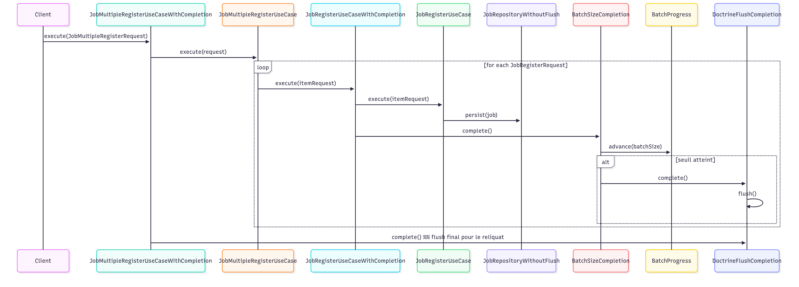
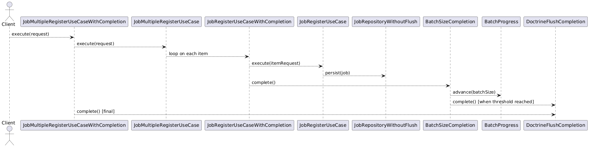
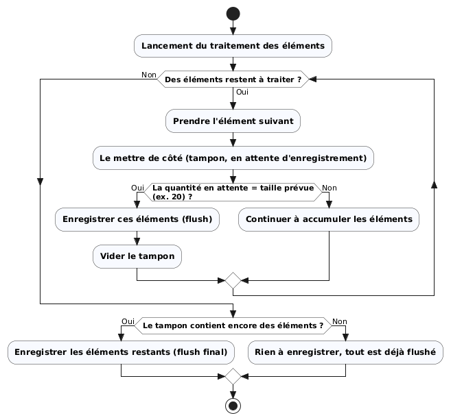

# Batch Processing (Clean Architecture & DDD)

Ce document présente la mise en place du **traitement par lots** (Batch Processing) autour du use case `JobMultipleRegister`, dans un projet organisé selon les principes de la Clean Architecture et du DDD. Il détaille :

- Les objectifs et le positionnement architectural
- Les briques du domaine (`BatchSize`, `BatchProgress`, interface `Completion`)
- Les implémentations (`BatchSizeCompletion`, `DoctrineFlushCompletion`, `JobRepositoryWithoutFlush`)
- Les décorateurs de use cases (`JobRegisterUseCaseWithCompletion`, `JobMultipleRegisterUseCaseWithCompletion`)
- La configuration Symfony
- Les diagrammes

---

## 1. Objectifs & principes

- **Séparer la logique métier** (use cases dans `Domain/UseCase`) des mécanismes techniques (flush Doctrine, etc.).
- **Déclencher les actions de "fin de lot" par paliers** : exécuter `flush()` seulement tous les *N* éléments, pas à chaque insertion.
- **Garantir une complétion finale** à la fin du traitement global (afin de traiter le reliquat si le dernier lot est incomplet).
- **Conserver la souplesse** : l’interface `Completion` ne se limite pas à `flush`/`commit`. Elle peut encapsuler n’importe quelle action de "complétion" (bulk ES, vidage de buffer, écriture disque, etc.).
- **Deux décorateurs complémentaires** :
    - `JobRegisterUseCaseWithCompletion` : appelle `Completion` après chaque élément (batché via `BatchSizeCompletion`).
    - `JobMultipleRegisterUseCaseWithCompletion` : appelle `Completion` une dernière fois à la fin pour flusher le reliquat.
---

## 2. Les briques du système

### 2.1 Interface `Completion`

```php
namespace App\Shared\Domain\Service;

interface Completion
{
    public function complete(): void;
}
```

**Rôle** : fournir un hook de complétion générique. Le contenu concret (flush, bulk, etc.) est libre.

### 2.2 `DoctrineFlushCompletion` (Infrastructure)

```php
final readonly class DoctrineFlushCompletion implements Completion
{
    public function __construct(
        private EntityManagerInterface $entityManager,
    ) {}

    public function complete(): void
    {
        $unitOfWork = $this->entityManager->getUnitOfWork();
        if (
            [] === $unitOfWork->getScheduledEntityInsertions()
            && [] === $unitOfWork->getScheduledEntityUpdates()
            && [] === $unitOfWork->getScheduledEntityDeletions()
        ) {
            return;
        }

        $this->entityManager->flush();
        $this->entityManager->clear();
    }
}
```

**Rôle** :

- Flusher **uniquement** lorsqu'il y a des changements planifiés (sinon on sort immédiatement).
- **Libérer la mémoire** en vidant l'`EntityManager` (`clear()`) après le flush pour éviter l'accumulation d'objets en mémoire lors des gros imports.

### 2.3 `BatchSize` (Domain)

```php
final readonly class BatchSize
{
    public function __construct(public int $value)
    {
        Assertion::greaterThan($this->value, 0, 'Batch size must be greater than 0.');
    }

    public function isReachedBy(int $count): bool
    {
        return $count >= $this->value;
    }
}
```

**Rôle** : encapsuler la taille du lot et valider sa cohérence.

### 2.4 `BatchProgress` (Domain)

```php
final class BatchProgress
{
    private int $count = 0;

    public function advance(BatchSize $batchSize): bool
    {
        ++$this->count;

        if ($batchSize->isReachedBy($this->count)) {
            $this->reset();

            return true; // Seuil atteint
        }

        return false;
    }

    private function reset(): void
    {
        $this->count = 0;
    }
}
```

**Rôle** : compter les éléments traités et signaler quand le seuil (`BatchSize`) est atteint.

### 2.5 `BatchSizeCompletion` (Domain)

```php
final readonly class BatchSizeCompletion implements Completion
{
    private function __construct(
        private Completion $innerCompletion,
        private BatchSize $batchSize,
        private BatchProgress $progress,
    ) {}

    public static function create(Completion $innerCompletion, BatchSize $batchSize): self
    {
        return new self(
            innerCompletion: $innerCompletion,
            batchSize: $batchSize,
            progress: new BatchProgress(),
        );
    }

    public function complete(): void
    {
        // Chaque appel incrémente la progression ;
        // l'innerCompletion n'est déclenchée que lorsque le seuil est atteint.
        if ($this->progress->advance($this->batchSize)) {
            $this->innerCompletion->complete();
        }
    }
}
```

**Rôle** : jouer le rôle d’adaptateur de lot. `innerCompletion->complete()` n’est appelée **que lorsque** `BatchProgress` indique que le seuil défini par `BatchSize` est atteint.

### 2.6 `JobRepositoryWithoutFlush` (Infrastructure)

```php
final readonly class JobRepositoryWithoutFlush implements JobRegisterCommand
{
    public function __construct(private EntityManagerInterface $entityManager) {}

    public function register(JobRegister $job): void
    {
        $this->entityManager->persist(JobRegisterMapper::domainToEntity($job));
        // Aucun flush ici : il est volontairement externalisé
    }
}
```

**Rôle** : persister sans flusher. Le use case dépend de l’interface `JobRegisterCommand` ; l’implémentation concrète utilisée ici est `JobRepositoryWithoutFlush`.

### 2.7 Use cases & décorateurs

#### `JobRegisterUseCase`

Use case métier unitaire : création et persistance d’un Job. Il dépend de l’interface `JobRegisterCommand`.

#### `JobRegisterUseCaseWithCompletion`

```php
final readonly class JobRegisterUseCaseWithCompletion implements JobRegisteringUseCase
{
    public function __construct(
        private JobRegisteringUseCase $innerUseCase,
        private Completion $completion,
    ) {}

    public function execute(JobRegisterRequest $request): void
    {
        $this->innerUseCase->execute($request);
        // On signale qu'un item vient d'être traité
        $this->completion->complete();
    }
}
```

**Rôle** : niveau « élémentaire ». Après chaque item, on incrémente la progression via `BatchSizeCompletion`.

#### `JobMultipleRegisterUseCase`

Use case métier global : découpe et enchaîne plusieurs `JobRegisterRequest`.

#### `JobMultipleRegisterUseCaseWithCompletion`

```php
final readonly class JobMultipleRegisterUseCaseWithCompletion implements JobMultipleRegisteringUseCase
{
    public function __construct(
        private JobMultipleRegisteringUseCase $innerUseCase,
        private Completion $completion,
    ) {}

    public function execute(JobMultipleRegisterRequest $request): void
    {
        $this->innerUseCase->execute($request);
        // Complétion finale pour vider le reste du buffer
        $this->completion->complete();
    }
}
```

**Rôle** : niveau « global ». Assure un dernier appel à `Completion` pour flusher le reliquat.

---

## 3. Configuration Symfony (services.yaml)

```yaml
services:
    # Taille du batch
    App\Shared\Domain\Batch\BatchSize:
        arguments: [ 20 ]

    # Complétion Doctrine (flush + clear)
    App\Infrastructure\Completion\Doctrine\DoctrineFlushCompletion: ~

    # Complétion par taille de groupe : décore DoctrineFlushCompletion
    App\Shared\Domain\Completion\BatchSizeCompletion:
        factory: [ null, 'create' ]
        arguments:
            $innerCompletion: '@App\Infrastructure\Completion\Doctrine\DoctrineFlushCompletion' # <-- décoré
            $batchSize: '@App\Shared\Domain\Batch\BatchSize'

    # Décorateur unitaire (utilise la completion batchée)
    App\Domain\Job\UseCase\Register\JobRegisterUseCaseWithCompletion:
        arguments:
            $innerUseCase: '@App\Domain\Job\UseCase\Register\JobRegisterUseCase'
            $completion: '@App\Shared\Domain\Completion\BatchSizeCompletion'

    # Décorateur global (flush final direct)
    App\Domain\Job\UseCase\MultipleRegister\JobMultipleRegisterUseCaseWithCompletion:
        arguments:
            $innerUseCase: '@App\Domain\Job\UseCase\MultipleRegister\JobMultipleRegisterUseCase'
            $completion: '@App\Infrastructure\Completion\Doctrine\DoctrineFlushCompletion'

    # Repository sans flush
    App\Infrastructure\Persistence\Doctrine\Repository\JobRepositoryWithoutFlush: ~
```

> Adapter les namespaces selon l’arborescence précise du projet.

---

## 4. Diagrammes

### 4.1 séquence détaillée




### 4.2 UML


---

### 4.3 diagramme d’activité UML


---

## 5. Points d’attention

- **Reste du dernier lot** : le décorateur global évite de laisser des entités non flushées.
- **Transactions** : aucune transaction globale n’est imposée ici ; à définir selon les besoins.
- **Performance** : ajuster `BatchSize` selon la volumétrie et la mémoire disponible.
- **Erreurs** : décider de la stratégie (flush partiel, rollback, etc.) en cas d’erreur en cours de traitement.
- **Effet de EntityManager::clear()** : après le flush, les entités deviennent détachées. Ne pas les réutiliser sans les recharger ou sans gérer explicitement leur état.

---

## 6. Mise en place rapide (checklist)

1. Créer `Completion`, `BatchSize`, `BatchProgress` dans le domaine partagé.
2. Créer `BatchSizeCompletion` (factory `create()`).
3. Ajouter `DoctrineFlushCompletion` (ou autre complétion) côté infrastructure.
4. Fournir un repository qui ne flush pas (`JobRepositoryWithoutFlush`).
5. Décorer les use cases :
   - `JobRegisterUseCaseWithCompletion` (élémentaire)
   - `JobMultipleRegisterUseCaseWithCompletion` (global)
6. Configurer les services Symfony (cf. YAML ci-dessus).
7. Tester unitaires + intégration.

---

