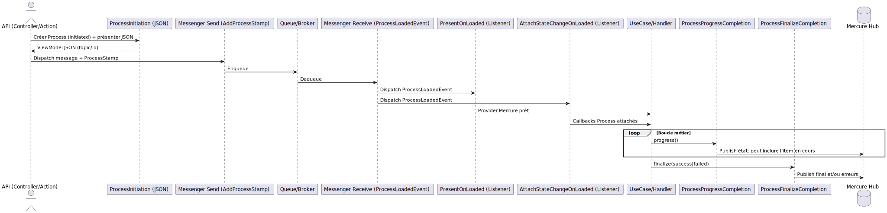
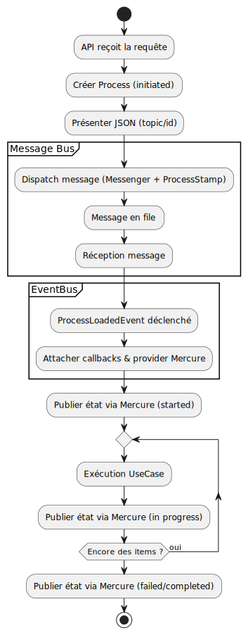

# Documentation technique — Orchestration **Process + Mercure**

Cette documentation explique le rôle de chaque service défini dans le fichier `services.yaml`, la chaîne d’exécution complète (du démarrage d’un **Process** à sa **finalisation**), ainsi que les points d’extension. L’ensemble respecte les principes **Clean Architecture / DDD** : la Présentation expose des *providers/presenters*, le Domaine déclenche des états et des *callbacks*, et l’Infrastructure connecte le bus de messages, Mercure et la sérialisation.

---

## 1) Vue d’ensemble

- **Process** : agrégat métier pilotant un cycle de vie (`initiated → started → in_progress → completed/failed`).
- **Presenters** : adaptent l’état du Process en **ViewModel** (JSON) et en **notifications Mercure** (temps réel).
- **Middlewares Messenger** :
  - ajoutent un **ProcessStamp** lors de l’envoi,
  - déclenchent un **ProcessLoadedEvent** lors de la réception, qui alimente les *listeners* de présentation/attacheurs.
- **Initiations & Completions** : démarrent le Process et publient l’avancement/la finalisation.
- **Attachers** : enregistrent des callbacks de présentation et de notification sur les changements d’état du Process.
- **Listeners** : branchent la présentation et les attacheurs quand l’évènement `ProcessLoaded` survient.

---

## 2) Présenters

### `presenter_process_json`

- **Alias** → `ChooseMyCompany\Shared\Presentation\Json\ProcessJsonPresenter`.
- **Rôle** : produire le **ViewModel JSON** contenant uniquement l’identifiant (topic) et l’état courant du Process (retour API immédiat).

### `presenter_process_mercure`

- **Classe** → `ChooseMyCompany\Shared\Presentation\Mercure\ProcessMercurePresenter`.
- **Rôle** : fournit un **ViewModel Mercure** basique par défaut (ne contenant que *topics* et *état*), utilisé par les attacheurs et complétions.

### `presenter_error_list_mercure`

- **Classe** → `ChooseMyCompany\Shared\Presentation\Mercure\ErrorListMercurePresenter`.
- **Args** : `$processProvider: @presenter_process_mercure`.
- **Rôle** : projection des **erreurs** d’un Process dans un **ViewModel Mercure** (pour finalisation en échec).

---

## 3) Message Bus — Middlewares

### `message_bus_middleware_add_process_stamp_json`

- **Classe** → `...\AddProcessStampMiddleware`.
- **Args** : `$processOutcome: @presenter_process_json`.
- **Rôle** : à **l’envoi** d’un message, vérifie si le Process a déjà été présenté ; si oui et qu’il existe, crée alors un *ProcessStamp* associé.

### `message_bus_middleware_process_loaded_event`

- **Classe** → `...\ProcessLoadedEventMiddleware`.
- **Args** : `$eventDispatching: @event_bus_dispatcher`.
- **Rôle** : à **la réception** d’un message, publie un **ProcessLoadedEvent** ; cela déclenche les listeners ci‑dessous qui branchent la présentation Mercure et les attacheurs sur le Process chargé.

> **Remarque** : les middlewares séparent clairement l’**étape API** (envoi + feedback JSON) de l’**étape de traitement** (réception + orchestration temps réel).

---

## 4) Notification Publisher (Mercure)

### `process_notification_publisher_mercure`

- **Classe** → `...\MercureProcessNotificationPublisher`.
- **Args** : `$hub: @mercure.hub.default.traceable`, `$serializer: @serializer`.
- **Rôle** : publication **temps réel** sur le Hub Mercure à partir des ViewModels fournis par `presenter_process_mercure` et/ou des complétions/attacheurs.

---

## 5) Process Initiation

### `process_initiation_json`

- **Classe** → `...\Domain\Initiation\ProcessInitiation`.
- **Args** : `$identifierGeneration: @generation_identifier`, `$processPresenter: @presenter_process_json`.
- **Rôle** : **crée** un Process (status `initiated`), **présente** l’état initial en JSON (retour API) et fournit l’identifiant/éventuel topic.

### `process_initiation_start_mercure`

- **Classe** → `...\Domain\Initiation\ProcessStartInitiation`.
- **Args** : `$provider: @presenter_process_mercure`.
- **Rôle** : **démarre** le Process (`started`) et renseigne le **provider Mercure** (topic, métadonnées) pour les diffusions ultérieures.

---

## 6) Process Completion

### `process_completion_progress_mercure`

- **Classe** → `...\Domain\Completion\ProcessProgressCompletion`.
- **Args** : `$provider: @presenter_process_mercure`.
- **Rôle** : à chaque **progrès** (boucle/batch), publie l’**état** via un évènement Mercure d’avancement, et peut également inclure l’item en cours.

### `process_completion_finalize_mercure`

- **Classe** → `...\Domain\Completion\ProcessFinalizeCompletion`.
- **Args** : `$errorOutcome: @presenter_error_list_mercure`, `$processProvider: @presenter_process_mercure`.
- **Rôle** : à la **fin** (success/failed), **publie** l’état final ; en cas d’échec, enrichit la payload via `error_list_mercure`.

---

## 7) Process Attachers (callbacks sur changements d’état)

Chaque attacher enregistre une **callback** sur le Process. Quand l’état change, la callback met à jour le ViewModel ou publie une notification.

- `process_attacher_view_model_started_mercure` → `StartedProcessViewModelCallbackAttacher`

  - `$viewModelAccess: @presenter_process_mercure`
  - **Action** : sur `started()`, prépare/émet le ViewModel Mercure.

- `process_attacher_view_model_in_progress_mercure` → `InProgressProcessViewModelCallbackAttacher`

  - **Action** : sur `inProgress()`, met à jour le ViewModel Mercure.

- `process_attacher_view_model_completed_mercure` → `CompletedProcessViewModelCallbackAttacher`

  - **Action** : sur `completed()`, finalise le ViewModel Mercure.

- `process_attacher_view_model_failed_mercure` → `FailedProcessViewModelCallbackAttacher`

  - **Action** : sur `failed()`, renseigne le ViewModel d’erreurs.

- `process_attacher_notification_process_mercure` → `ProcessNotificationCallbackAttacher`

  - `$notificationPublisher: @process_notification_publisher_mercure`
  - **Action** : à chaque **state change**, publie la notification correspondante via Mercure.

- `process_attacher_state_change_multiple_mercure` → `MultipleProcessStateChangeAttacher`

  - **Args (liste)** : compose tous les attacheurs ci‑dessus ; un seul point d’attache pour le Process.

---

## 8) Process Event Listeners

- `event_listener_process_present_on_loaded_mercure` → `PresentProcessOnProcessLoadedEventListener`

  - `$presenter: @presenter_process_mercure`
  - **Rôle** : quand `ProcessLoadedEvent` survient (à la **réception** du message), **présente** immédiatement le Process complet via le provider Mercure (initialisation du contexte temps réel : topic, clés, etc.).

- `event_listener_process_attach_state_change_on_loaded_mercure` → `AttachProcessStateChangeOnProcessLoadedEventListener`

  - `$attacher: @process_attacher_state_change_multiple_mercure`
  - **Rôle** : à ce même évènement, **attache** l’ensemble des callbacks (started/in\_progress/completed/failed + notifications) au Process chargé.

---

## 9) Chaîne d’exécution (runtime)

---

## 10) Diagramme d’activité (UML)

---

## 11) Points d’extension

- **Changer de transport temps réel** : implémenter un `ProcessNotificationPublisher` alternatif, remplacer l’instance Mercure dans `process_notification_publisher_mercure`.
- **Ajouter un nouveau canal de présentation** (ex. email) : créer un `*Presenter` dédié + un attacher ou une completion qui l’exploite (ex. `EmailOnFailedCompletion`).
- **Nouveaux états** : ajouter un attacher ciblé, ou enrichir `MultipleProcessStateChangeAttacher`.
- **Batch/Progress** : composer `ProcessProgressCompletion` avec un décorateur de type `BatchSizeCompletion` pour contrôler la fréquence des publications.

---

## 12) Bonnes pratiques & conventions

- **Naming** : rester sur `snake_case` pour les ids de services et `PascalCase` pour les classes.
- **Séparation** :
  - *Presentation* (= mapping ViewModel, sérialisation) indépendante du domaine.
  - *Domain* (= Process, Attachers, Initiations, Completions) sans dépendance à Symfony.
  - *Infrastructure* (= Messenger, Hub, Serializer) encapsule les frameworks.
- **Idempotence** des callbacks : les attacheurs doivent supporter plusieurs invocations sans effet secondaire inattendu.

---

## 13) Dépannage rapide

- **Aucun évènement Mercure reçu** :
  - vérifier le **topic** initial (retourné par `process_initiation_json`),
  - `process_initiation_start_mercure` bien invoqué avant les publications,
  - `process_listener_*` bien taggés `kernel.event_listener` et déclenchés par `ProcessLoadedEventMiddleware`.
- **Pas de progression visible** : s’assurer que `ProcessProgressCompletion` est **appelé dans la boucle** et que le Hub fonctionne.
- **Erreurs non projetées** : vérifier le câblage `process_completion_finalize_mercure` + `presenter_error_list_mercure`.
