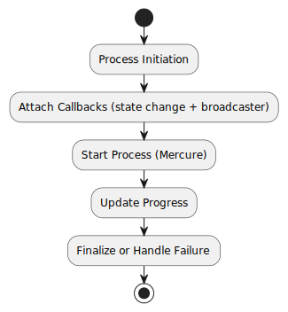
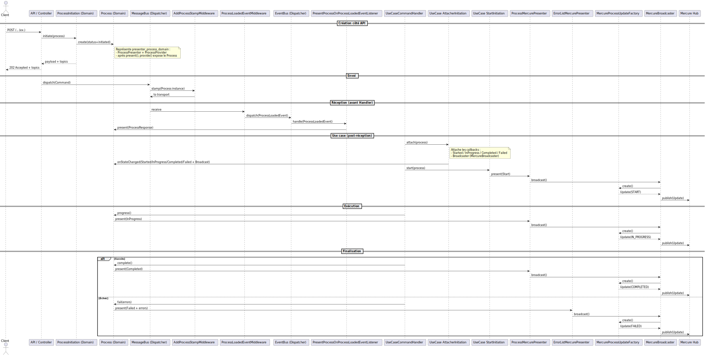
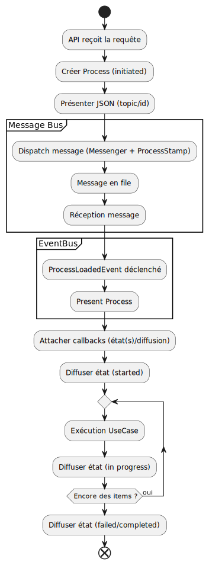

# 1. Vue d’ensemble

Le système **Mercure** est utilisé pour diffuser en temps réel l’état d’avancement d’un `Process` vers les clients abonnés.  
La configuration repose sur une série de **presenters**, **attachers**, une **logique de diffusion (broadcaster)** et des **initiations**, permettant d’initialiser correctement les callbacks du `Process`, de diffuser ses mises à jour en temps réel et d’assurer leur suivi jusqu’à la complétion ou l’échec.

Il est également possible d’ajouter ses propres attachers ou de personnaliser la diffusion pour l’adapter à des besoins métiers spécifiques.

---

# 2. Structure des services

## 2.1. Presenters

Les presenters sont responsables de la présentation des données liées à l’état du process :

| Service ID                               | Classe                                  | Rôle                                       |
|------------------------------------------|-----------------------------------------|--------------------------------------------|
| `process_presenter_domain`               | `...ProcessDomainPresenter`             | Provider + état du Process (domaine)       |
| `process_presenter_json`                 | `...ProcessJsonPresenter`               | Présentation des données en JSON           |
| `process_presenter_broadcast`            | `...ProcessBroadcastPresenter`          | Présentation des données pour diffusion    |
| `process_error_list_presenter_broadcast` | `...ErrorListProcessBroadcastPresenter` | Présentation des erreurs pour diffusion    |

## 2.2. Attachers

Tous héritent d’un attacher générique `ProcessBroadcastingAttacher` injectant : `processProvider`, `viewModelAccess`, `broadcasting`.

| Service ID                                                | Classe                                                                   | Rôle                             |
|-----------------------------------------------------------|--------------------------------------------------------------------------|----------------------------------|
| `process_state_change_broadcasting_attacher_mercure`      | `...ProcessStateChangeBroadcastingAttacher`                              | Diffusion pour tous les états    |
| `process_started_broadcasting_attacher_mercure`           | `...ProcessStartedBroadcastingAttacher`                                  | Diffusion à l’état `started`     |
| `process_in_progress_broadcasting_attacher_mercure`       | `...InProgressProcessVie wModelCallbackAttacher`                         | Diffusion à l’état `in_progress` |
| `process_completed_broadcasting_attacher_mercure`         | `...CompletedProcessViewModelCallbackAttacher`                           | Diffusion à l’état `completed`   |
| `process_failed_broadcasting_attacher_mercure`            | `...FailedProcessViewModelCallbackAttacher`                              | Diffusion à l’état `failed`      |
| `process_failed_error_list_broadcasting_attacher_mercure` | `...FailedProcessViewModelCallbackAttacher` (version erreurs détaillées) | Diffusion à l’état `failed`      |

## 2.3. Initiation

Dès l’initiation du `Process`, les différents **attachers** sont appliqués automatiquement.  
Les services suivants orchestrent cette phase d’initialisation :

| Service ID                            | Classe                         | Rôle                                                                                                        |
|---------------------------------------|--------------------------------|-------------------------------------------------------------------------------------------------------------|
| `process_initiation`                  | `...ProcessInitiation`         | Création du process et mise à disposition via le `ProcessProvider`, connecté au `process_presenter_domain`. |
| `process_attacher_initiation_mercure` | `...ProcessAttacherInitiation` | Ajout des attachers Mercure au process lors de l’initiation                                                 |
| `process_start_initiation`            | `...ProcessStartInitiation`    | Démarrage automatique du process avec Mercure                                                               |
| `process_multiple_initiation`         | `...MultipleInitiation`        | Regroupe les initiations pour un démarrage cohérent du process                                              |

## 2.4. Completion

À la complétion, des services dédiés gèrent les étapes de progression et de finalisation :

| Service ID                      | Classe                         | Rôle                                                      |
|---------------------------------|--------------------------------|-----------------------------------------------------------|
| `process_progress_completion`   | `...ProcessProgressCompletion` | Mise à jour des informations de progression               |
| `process_finalize_completion`   | `...ProcessFinalizeCompletion` | Finalisation du process et envoi des erreurs si présentes |

## 2.5. Event Bus (listener)

- `process_present_on_loaded_event_listener` — `...PresentProcessOnProcessLoadedEventListener`  
  À la réception d’un `ProcessLoadedEvent`, le listener vérifie que le `Process` n’a pas déjà été présenté (`PresenterState`).  
  Il construit un `ProcessResponse` à partir de l’événement, puis appelle `present()` sur `process_presenter_domain`.  
  Ainsi, `process_presenter_domain` (qui implémente **ProcessPresenter, ProcessProvider, PresenterState, ResetState**) rend le `Process` disponible via **ProcessProvider** pour les composants en aval.

---

# 3. Schémas

## 3.1. Diagramme du flux



## 3.2. Diagramme de séquence (détaillé)



## 3.3. Diagramme d’activité (UML)



---

# 4. Mapping des services (référence YAML)

- **Presenters**
  - `process_presenter_json` → ProcessJsonPresenter
  - `presenter_process_mercure` → ProcessMercurePresenter
  - `presenter_error_list_mercure` → ErrorListMercurePresenter
- **Message bus / Middleware**
  - `process_stamp_add_middleware_message_bus` → AddProcessStampMiddleware (outcome: JSON)
  - `process_loaded_event_middleware_message_bus` → ProcessLoadedEventMiddleware (dispatch évènement via `event_bus_dispatcher`)
- **Event bus**
  - `event_bus_dispatcher` → SymfonyEventDispatcher
  - Listener: `process_present_on_loaded_event_listener` (présentation uniquement)
- **Broadcaster (Mercure)**
  - `process_update_factory_mercure` → MercureProcessUpdateFactory (processProvider + serializer)
  - `process_broadcaster_mercure` → MercureBroadcaster (hub)
- **Attachers**
  - `process_attacher_view_model_started_mercure`
  - `process_attacher_view_model_in_progress_mercure`
  - `process_attacher_view_model_completed_mercure`
  - `process_attacher_view_model_failed_mercure`
  - `process_attacher_view_model_failed_error_list_mercure` (variante erreurs détaillées)
  - `process_attacher_state_change_mercure` (agrégateur)
- **Initiations**
  - `process_initiation`
  - `process_attacher_initiation_mercure`
  - `process_start_initiation`
  - `process_multiple_initiation` (MultipleInitiation)
- **Completion**
  - `process_progress_completion`
  - `process_finalize_completion`

---

# 5. Ordre d’attachement et déclenchement

L’exécution d’un process suit un ordre précis pour garantir la cohérence entre les initiations, les attachers, le broadcaster et les phases de finalisation :

1. **Initiation JSON** : création du `Process` et mise à disposition des `topics` pour les abonnements clients.
2. **MessageBus** : ajout des stamps puis déclenchement du handler pour exécuter les étapes métier (progression, finalisation ou échec).
3. **EventBus** : relais des événements liés au process après la réception du message.
4. **Initiation Attacher** : enregistrement de tous les callbacks nécessaires :
    - `Started`, `InProgress`, `Completed`, `Failed` pour la présentation des états via les presenters.
    - **Broadcaster** : attachement du `MercureBroadcaster` afin que chaque changement d’état du `Process` déclenche automatiquement la génération d’un `Update` via `MercureProcessUpdateFactory` puis sa diffusion en temps réel sur le hub Mercure.
5. **Initiation Start** : publication de l’événement de démarrage après l’attachement des callbacks et le lancement du traitement.
6. **Completion** : gestion de l’évolution et de la finalisation du process :
    - `InProgress` : diffusion de la progression intermédiaire.
    - `Completed` : diffusion de l’état final de succès.
    - `Failed` : diffusion de l’état final d’échec avec les détails d’erreurs le cas échéant.

---

# 6. Variante erreurs détaillées (Failed)

Pour publier une vue d’erreurs enrichie lors d’un échec, utilisez `process_error_list_presenter_broadcast` via l’attacher dédié :

```yaml
process_failed_error_list_broadcasting_attacher_mercure:
    class: ChooseMyCompany\Shared\Domain\Attacher\Process\ProcessFailedBroadcastingAttacher
    arguments:
        $viewModelAccess: '@process_error_list_presenter_broadcast'

process_attacher_state_change_mercure:
    class: ChooseMyCompany\Shared\Domain\Attacher\MultipleAttacher
    arguments:
        - '@process_started_broadcasting_attacher_mercure'
        - '@process_attacher_view_model_failed_error_list_mercure'
        - '@process_completed_broadcasting_attacher_mercure'
        - '@process_failed_error_list_broadcasting_attacher_mercure'
```

# 7. Points d’extension

- **Ajouter ses propres attachers** : vous pouvez créer vos services spécifiques pour enrichir ou remplacer des callbacks par défaut. Par exemple :

```yaml
job_register_process_presenter_broadcast:
    class: App\Presentation\Broadcast\Job\Register\JobRegisterProcessBroadcastPresenter
    arguments:
        $processProvider: '@process_presenter_domain'
        $jobProvider: '@job_register_presenter_domain'

job_register_process_in_progress_attacher_broadcast_mercure:
    parent: process_attacher_broadcast_mercure
    class: App\Shared\Domain\Attacher\Process\ProcessInProgressBroadcastingAttacher
    arguments:
        $viewModelAccess: '@job_register_process_presenter_broadcast'

job_multiple_register_process_attacher_state_change:
    class: App\Shared\Domain\Attacher\MultipleAttacher
    arguments:
        - '@process_started_attacher_broadcast_mercure'
        - '@job_register_process_in_progress_attacher_broadcast_mercure'
        - '@process_completed_attacher_broadcast_mercure'
        - '@process_failed_error_list_attacher_broadcast_mercure'
```

- **Ajouter un nouveau canal** (ex. e‑mail) en créant un `...NotificationPublisher` et en l’intégrant dans un `MultipleAttacher` personnalisé.
- **Changer le *****outcome***** du middleware** en injectant un presenter différent dans `process_stamp_add_middleware_message_bus`.
