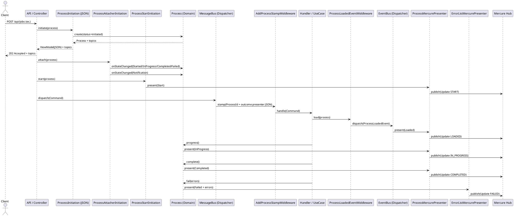
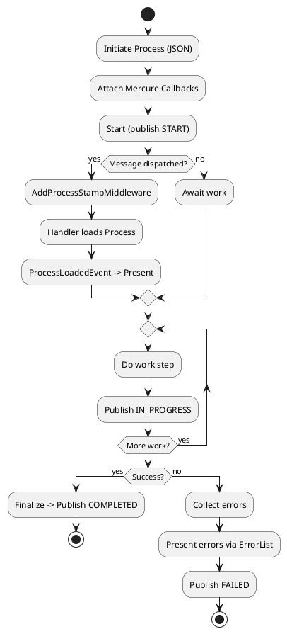

# 1. Vue d’ensemble

Le système de notifications **Mercure** est utilisé pour diffuser en temps réel l’état d’avancement d’un `Process` vers les clients abonnés. La configuration repose sur une série de **presenters**, **attachers**, et **initiations** permettant d’initialiser correctement les callbacks du process et d’assurer leur suivi jusqu’à la complétion ou l’échec.

Il est également possible d’ajouter ses propres attachers personnalisés pour adapter le comportement à des cas métiers spécifiques.

---

# 2. Structure des services

## 2.1. Presenters

Les presenters sont responsables de la présentation des données liées à l’état du process :

| Service ID                     | Classe                                                                  | Rôle                                       |
| ------------------------------ | ----------------------------------------------------------------------- | ------------------------------------------ |
| `presenter_process_json`       | `ChooseMyCompany\Shared\Presentation\Json\ProcessJsonPresenter`         | Présentation des données en JSON           |
| `presenter_process_mercure`    | `ChooseMyCompany\Shared\Presentation\Mercure\ProcessMercurePresenter`   | Présentation des données au format Mercure |
| `presenter_error_list_mercure` | `ChooseMyCompany\Shared\Presentation\Mercure\ErrorListMercurePresenter` | Présentation des erreurs via Mercure       |

## 2.2. Attachers

Les attachers définissent les callbacks qui réagiront aux changements d’état du `Process` :

| Service ID                                              | Classe                                                                   | Rôle                                                                |
| ------------------------------------------------------- | ------------------------------------------------------------------------ | ------------------------------------------------------------------- |
| `process_attacher_view_model_started_mercure`           | `...StartedProcessViewModelCallbackAttacher`                             | Callback pour l’état `started`                                      |
| `process_attacher_view_model_in_progress_mercure`       | `...InProgressProcessViewModelCallbackAttacher`                          | Callback pour l’état `in_progress`                                  |
| `process_attacher_view_model_completed_mercure`         | `...CompletedProcessViewModelCallbackAttacher`                           | Callback pour l’état `completed`                                    |
| `process_attacher_view_model_failed_mercure`            | `...FailedProcessViewModelCallbackAttacher`                              | Callback pour l’état `failed`                                       |
| `process_attacher_view_model_failed_error_list_mercure` | `...FailedProcessViewModelCallbackAttacher` (version erreurs détaillées) |                                                                     |
| `process_attacher_notification_process_mercure`         | `...ProcessNotificationCallbackAttacher`                                 | Publication des notifications liées au process                      |
| `process_attacher_state_change_mercure`                 | `...MultipleProcessStateChangeAttacher`                                  | Regroupe tous les attachers ci-dessus pour un enregistrement groupé |

## 2.3. Initiation

Depuis cette refonte, **les attachers sont désormais appliqués dès l’initiation** du `Process`. Les services suivants orchestrent l’initialisation :

| Service ID                            | Classe                         | Rôle                                                            |
| ------------------------------------- | ------------------------------ | --------------------------------------------------------------- |
| `process_initiation_json`             | `...ProcessInitiation`         | Création initiale du process et association d’un presenter JSON |
| `process_initiation_attacher_mercure` | `...ProcessAttacherInitiation` | Ajout des attachers Mercure au process lors de l’initiation     |
| `process_initiation_start_mercure`    | `...ProcessStartInitiation`    | Démarrage automatique du process avec Mercure                   |
| `process_initiation_mercure`          | `...MultipleInitiation`        | Regroupe les initiations pour un démarrage cohérent du process  |

## 2.4. Completion

À la complétion, des services dédiés gèrent les étapes de progression et de finalisation :

| Service ID                            | Classe                         | Rôle                                                      |
| ------------------------------------- | ------------------------------ | --------------------------------------------------------- |
| `process_completion_progress_mercure` | `...ProcessProgressCompletion` | Mise à jour des informations de progression               |
| `process_completion_finalize_mercure` | `...ProcessFinalizeCompletion` | Finalisation du process et envoi des erreurs si présentes |

---

# 3. Schémas

## 3.1. Diagramme du flux


## 3.2. Diagramme de séquence (détaillé)



## 3.3. Diagramme d’activité (UML)



---

# 4. Mapping des services (référence YAML)

- **Presenters**
  - `presenter_process_json` → ProcessJsonPresenter
  - `presenter_process_mercure` → ProcessMercurePresenter
  - `presenter_error_list_mercure` → ErrorListMercurePresenter
- **Message bus / Middleware**
  - `message_bus_middleware_add_process_stamp_json` → AddProcessStampMiddleware (outcome: JSON)
  - `message_bus_middleware_process_loaded_event` → ProcessLoadedEventMiddleware (dispatch évènement via `event_bus_dispatcher`)
- **Event bus**
  - `event_bus_dispatcher` → SymfonyEventDispatcher
  - Listener: `event_listener_process_present_on_loaded_mercure` (présentation uniquement)
- **Notification**
  - `process_notification_publisher_mercure` → MercureProcessNotificationPublisher (hub + serializer)
- **Attachers**
  - `process_attacher_view_model_started_mercure`
  - `process_attacher_view_model_in_progress_mercure`
  - `process_attacher_view_model_completed_mercure`
  - `process_attacher_view_model_failed_mercure`
  - `process_attacher_view_model_failed_error_list_mercure` (variante erreurs détaillées)
  - `process_attacher_notification_process_mercure`
  - `process_attacher_state_change_mercure` (agrégateur)
- **Initiations**
  - `process_initiation_json`
  - `process_initiation_attacher_mercure`
  - `process_initiation_start_mercure`
  - `process_initiation_mercure` (MultipleInitiation)
- **Completion**
  - `process_completion_progress_mercure`
  - `process_completion_finalize_mercure`

---

# 5. Ordre d’attachement et déclenchement

L’exécution d’un process suit un ordre précis pour garantir la cohérence entre les initiations, les attachers et les notifications :

1. **Initiation JSON** : création du `Process` et mise à disposition des `topics` pour les abonnements clients.
2. **MessageBus** : ajout des stamps puis déclenchement du handler pour exécuter les étapes métier (progression, finalisation ou échec).
3. **EventBus** : relais des événements liés au process après la réception du message.
4. **Initiation Attacher** : enregistrement de tous les callbacks nécessaires (`Started`, `InProgress`, `Completed`, `Failed`, `Notification`) pour gérer les changements d’état tout au long du cycle de vie du process.
5. **Initiation Start** : publication de l’événement de démarrage après l’attachement des callbacks et le lancement du traitement.

---

# 6. Variante erreurs détaillées (Failed)

Pour publier une vue d’erreurs enrichie lors d’un échec, utilisez `presenter_error_list_mercure` via l’attacher dédié :

```yaml
process_attacher_view_model_failed_error_list_mercure:
    class: ChooseMyCompany\Shared\Domain\Attacher\FailedProcessViewModelCallbackAttacher
    arguments:
        $viewModelAccess: '@presenter_error_list_mercure'

# Dans l’agrégateur, remplacez l’attacher failed standard si souhaité
process_attacher_state_change_mercure:
    class: ChooseMyCompany\Shared\Domain\Attacher\MultipleProcessStateChangeAttacher
    arguments:
        - '@process_attacher_view_model_started_mercure'
        - '@process_attacher_view_model_in_progress_mercure'
        - '@process_attacher_view_model_completed_mercure'
        - '@process_attacher_view_model_failed_error_list_mercure'
        - '@process_attacher_notification_process_mercure'
```

# 7. Points d’extension

- **Ajouter ses propres attachers** : vous pouvez créer vos services spécifiques pour enrichir ou remplacer des callbacks par défaut. Par exemple :

```yaml
job_multiple_register_process_attacher_view_model_in_progress_mercure:
    class: App\Shared\Domain\Attacher\InProgressProcessViewModelCallbackAttacher
    arguments:
        $viewModelAccess: '@presenter_job_register_mercure'

job_multiple_register_process_attacher_state_change_mercure:
    class: App\Shared\Domain\Attacher\MultipleProcessStateChangeAttacher
    arguments:
        - '@process_attacher_view_model_started_mercure'
        - '@job_multiple_register_process_attacher_view_model_in_progress_mercure'
        - '@process_attacher_view_model_completed_mercure'
        - '@process_attacher_view_model_failed_error_list_mercure'
        - '@process_attacher_notification_process_mercure'
```

- **Ajouter un nouveau canal** (ex. e‑mail) en créant un `...NotificationPublisher` et en l’intégrant dans un `MultipleProcessStateChangeAttacher` personnalisé.
- **Changer le *****outcome***** du middleware** en injectant un presenter différent dans `message_bus_middleware_add_process_stamp_json`.
