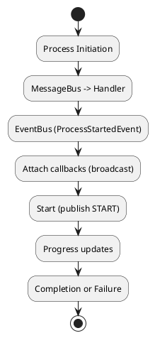
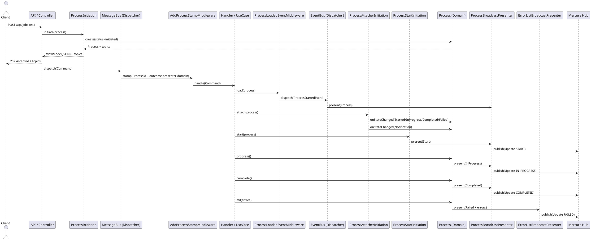

# 1. Vue d’ensemble

Le système de notifications **Mercure** diffuse en temps réel l’état d’avancement d’un `Process` vers les clients abonnés. La configuration repose sur des **presenters**, des **attachers**, et des **initiations** permettant d’initialiser correctement les callbacks et d’assurer leur suivi jusqu’à la complétion ou l’échec.

Il est également possible d’ajouter des attachers personnalisés pour des cas métiers spécifiques.

---

# 2. Structure des services

## 2.1. Presenters

| Service ID                               | Classe                                                                          | Rôle                                                      |
| ---------------------------------------- | ------------------------------------------------------------------------------- | --------------------------------------------------------- |
| `process_presenter_domain`               | `ChooseMyCompany\\Shared\\Presentation\\Domain\\ProcessDomainPresenter`         | Fournit le process pour le domaine                        |
| `process_presenter_json`                 | `ChooseMyCompany\\Shared\\Presentation\\Json\\ProcessJsonPresenter`             | Présentation JSON, avec gestion des erreurs et du process |
| `process_presenter_broadcast`            | `ChooseMyCompany\\Shared\\Presentation\\Broadcast\\ProcessBroadcastPresenter`   | Présentation du process pour diffusion                    |
| `process_error_list_presenter_broadcast` | `ChooseMyCompany\\Shared\\Presentation\\Broadcast\\ErrorListBroadcastPresenter` | Présentation des erreurs pour diffusion                   |

## 2.2. Middleware (Message Bus)

| Service ID                                    | Classe                            | Rôle                                                     |
| --------------------------------------------- | --------------------------------- | -------------------------------------------------------- |
| `process_stamp_add_middleware_message_bus`    | `...AddProcessStampMiddleware`    | Ajout des stamps avec outcome `process_presenter_domain` |
| `process_loaded_event_middleware_message_bus` | `...ProcessLoadedEventMiddleware` | Dispatch de l’événement de process chargé via EventBus   |

## 2.3. Event Bus

| Service ID                                 | Classe                                          | Rôle                                                                     |
| ------------------------------------------ | ----------------------------------------------- | ------------------------------------------------------------------------ |
| `process_present_on_loaded_event_listener` | `...PresentProcessOnProcessLoadedEventListener` | Présente le process dès son chargement via le `process_presenter_domain` |

## 2.4. Broadcaster

| Service ID               | Classe                    | Rôle                                    |
| ------------------------ | ------------------------- | --------------------------------------- |
| `update_factory_mercure` | `...MercureUpdateFactory` | Fabrique des updates Mercure sérialisés |
| `broadcaster_mercure`    | `...MercureBroadcaster`   | Publie les updates dans le hub Mercure  |

## 2.5. Attachers

Tous héritent d’un attacher générique `ProcessBroadcastingCallbackAttacher` injectant : `processProvider`, `viewModelAccess`, `broadcasting`.

| Service ID                                               | Classe                                                              | Rôle                               |
| -------------------------------------------------------- | ------------------------------------------------------------------- | ---------------------------------- |
| `process_attacher_broadcast_process_started_mercure`     | `...StartedProcessBroadcastingCallbackAttacher`                     | Diffusion à l’état Started         |
| `process_attacher_broadcast_process_in_progress_mercure` | `...InProgressProcessBroadcastingCallbackAttacher`                  | Diffusion à l’état InProgress      |
| `process_attacher_broadcast_process_completed_mercure`   | `...CompletedProcessBroadcastingCallbackAttacher`                   | Diffusion à l’état Completed       |
| `process_attacher_broadcast_process_failed_mercure`      | `...FailedProcessBroadcastingCallbackAttacher`                      | Diffusion à l’état Failed          |
| `process_attacher_broadcast_process_error_list_mercure`  | `...FailedProcessBroadcastingCallbackAttacher` (erreurs détaillées) | Diffusion des erreurs détaillées   |
| `process_attacher_state_change_mercure`                  | `...MultipleAttacher`                                               | Agrégation des attachers ci-dessus |

## 2.6. Initiations

| Service ID                             | Classe                      | Rôle                                                |
|----------------------------------------| --------------------------- | --------------------------------------------------- |
| `process_initiation`                   | `...ProcessInitiation`      | Création du process et attribution d’un identifiant |
| `process_attacher_initiation_mercure`  | `...AttacherInitiation`     | Attache les callbacks Mercure                       |
| `process_start_initiation`             | `...ProcessStartInitiation` | Publie l’événement de démarrage                     |
| `process_multiple_initiation`          | `...MultipleInitiation`     | Orchestre `attacher` et `start`                     |

## 2.7. Completion

| Service ID                    | Classe                         | Rôle                                |
| ----------------------------- | ------------------------------ | ----------------------------------- |
| `process_progress_completion` | `...ProcessProgressCompletion` | Mise à jour de la progression       |
| `process_finalize_completion` | `...ProcessFinalizeCompletion` | Finalisation et gestion des erreurs |

---

# 3. Schémas

## 3.1. Diagramme du flux

## 3.2. Diagramme de séquence (détaillé)

---

# 4. Ordre d’attachement et déclenchement

1. **Initiation** : création du process et exposition des topics.
2. **MessageBus** : ajout des stamps, exécution du handler.
3. **EventBus** : émission du `ProcessStartedEvent` et présentation du process.
4. **Initiation Attacher** : enregistrement des callbacks de diffusion.
5. **Initiation Start** : publication de l’événement de démarrage.
6. **Progression** et **finalisation** : updates InProgress, Completed ou Failed diffusés.

---

# 5. Points d’extension

- Ajouter des **attachers personnalisés** pour un cas métier particulier.
- Remplacer un **presenter** ou un **broadcaster** par une autre implémentation.
- Ajouter un **canal de diffusion** (ex. email, websocket) via un nouvel attacher.

